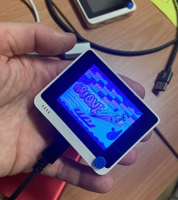
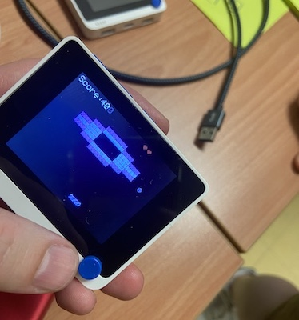
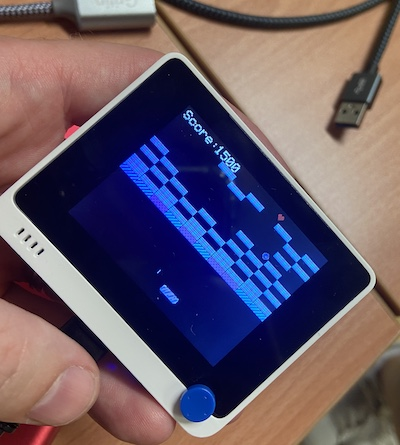
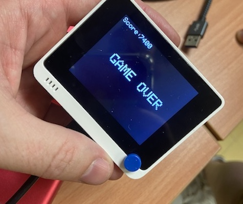

# WioTerminal Game

This project has been released during a Game Jam on June 18th 2022 with my daughter ([doing drawings](https://www.instagram.com/juju_pnlt/)) and a 1st grade student Clement Laporte from Technology Institute of Clermont-Ferrand University.

The purpose of a Game Jam is to realize a game in a limited time on a given theme the teams are discovering at start of the event. 

During this event, we had 10 hours to create a game from scratch and the theme has been "this is not a bug but a feature".

We decided to create a brick breacker that randomly change the running level (this is the bug), this creates a new challenge in the game (so it is a feature). We decided to make it with a WioTerminal from SeeedStudio, using Arduino envrionement.

## Some of the bugs are not features

As the time has been limited and we tried to add features up to the last minutes of the contest, the last one added, related to the multi-life management is a bit buggy (you will see on the screen). This is not a feature but normal as the time as been over.

## what we did not had the time to do, but planned

We had some features we were expecting to do but we did not had the time to implement:
- add sound on action
- make action on bricks like extending/reducing the bar size

## Test it

If you have a WioTerminal, you can get the .uf2 file in the binary repository. Drag & Drop it on your WioTerminal drive and you go.

## Bugfix it / Modify it

Just open the project on Arduino environement and you go ...